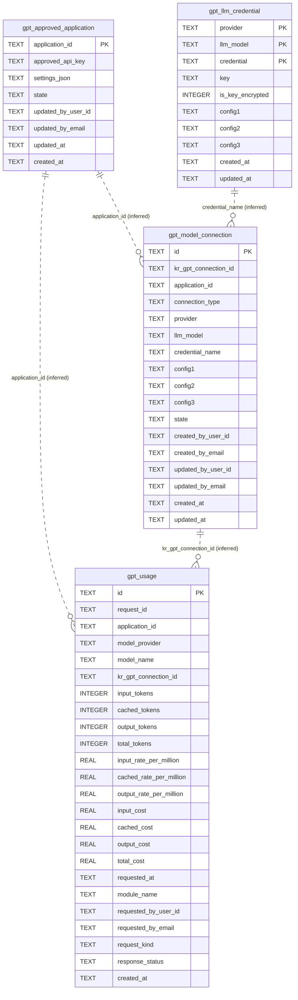

# KR GPT Usage Database Schema 1.1 Mermaid ERD source

```mermaid
erDiagram
  gpt_approved_application ||..o{ gpt_model_connection : "application_id (inferred)"
  gpt_approved_application ||..o{ gpt_usage : "application_id (inferred)"
  gpt_model_connection ||..o{ gpt_usage : "kr_gpt_connection_id (inferred)"
  gpt_llm_credential ||..o{ gpt_model_connection : "credential_name (inferred)"
  gpt_approved_application {
    TEXT application_id PK
    TEXT approved_api_key
    TEXT settings_json
    TEXT state
    TEXT updated_by_user_id
    TEXT updated_by_email
    TEXT updated_at
    TEXT created_at
  }
  gpt_llm_credential {
    TEXT provider PK
    TEXT llm_model PK
    TEXT credential PK
    TEXT key
    INTEGER is_key_encrypted
    TEXT config1
    TEXT config2
    TEXT config3
    TEXT created_at
    TEXT updated_at
  }
  gpt_model_connection {
    TEXT id PK
    TEXT kr_gpt_connection_id
    TEXT application_id
    TEXT connection_type
    TEXT provider
    TEXT llm_model
    TEXT credential_name
    TEXT config1
    TEXT config2
    TEXT config3
    TEXT state
    TEXT created_by_user_id
    TEXT created_by_email
    TEXT updated_by_user_id
    TEXT updated_by_email
    TEXT created_at
    TEXT updated_at
  }
  gpt_usage {
    TEXT id PK
    TEXT request_id
    TEXT application_id
    TEXT model_provider
    TEXT model_name
    TEXT kr_gpt_connection_id
    INTEGER input_tokens
    INTEGER cached_tokens
    INTEGER output_tokens
    INTEGER total_tokens
    REAL input_rate_per_million
    REAL cached_rate_per_million
    REAL output_rate_per_million
    REAL input_cost
    REAL cached_cost
    REAL output_cost
    REAL total_cost
    TEXT requested_at
    TEXT module_name
    TEXT requested_by_user_id
    TEXT requested_by_email
    TEXT request_kind
    TEXT response_status
    TEXT created_at
  }
```
