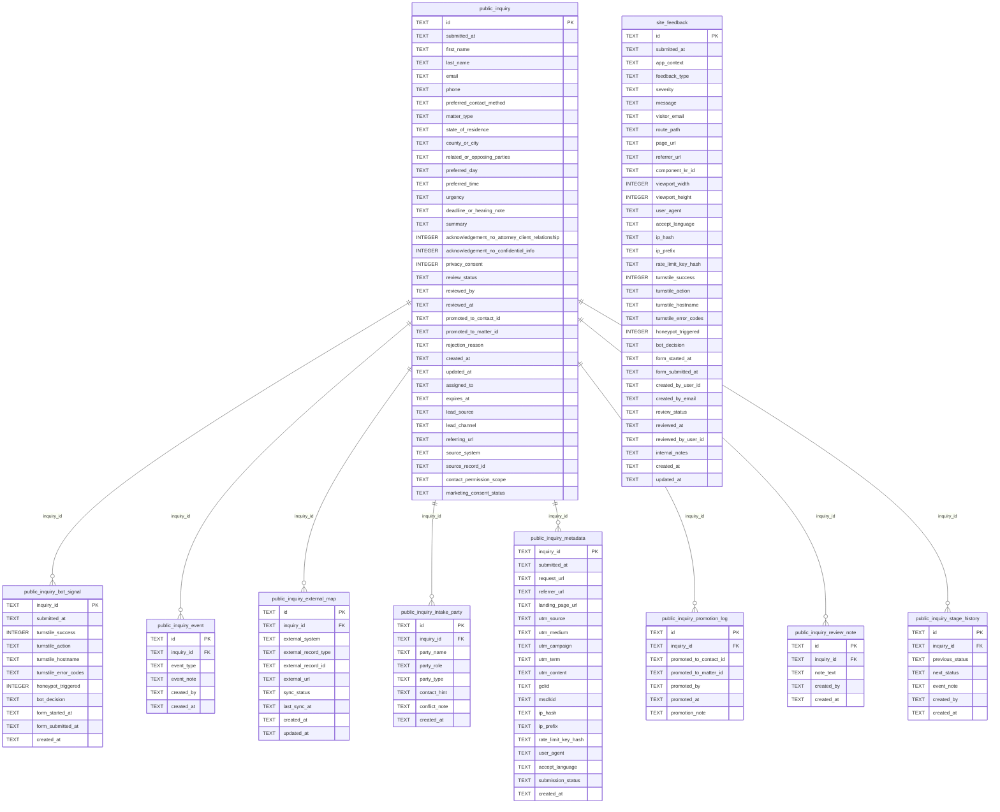

# KR Public Inquiry Database Schema 2.0 Mermaid ERD source

```mermaid
erDiagram
  public_inquiry ||--o{ public_inquiry_bot_signal : "inquiry_id"
  public_inquiry ||--o{ public_inquiry_event : "inquiry_id"
  public_inquiry ||--o{ public_inquiry_external_map : "inquiry_id"
  public_inquiry ||--o{ public_inquiry_intake_party : "inquiry_id"
  public_inquiry ||--o{ public_inquiry_metadata : "inquiry_id"
  public_inquiry ||--o{ public_inquiry_promotion_log : "inquiry_id"
  public_inquiry ||--o{ public_inquiry_review_note : "inquiry_id"
  public_inquiry ||--o{ public_inquiry_stage_history : "inquiry_id"
  public_inquiry {
    TEXT id PK
    TEXT submitted_at
    TEXT first_name
    TEXT last_name
    TEXT email
    TEXT phone
    TEXT preferred_contact_method
    TEXT matter_type
    TEXT state_of_residence
    TEXT county_or_city
    TEXT related_or_opposing_parties
    TEXT preferred_day
    TEXT preferred_time
    TEXT urgency
    TEXT deadline_or_hearing_note
    TEXT summary
    INTEGER acknowledgement_no_attorney_client_relationship
    INTEGER acknowledgement_no_confidential_info
    INTEGER privacy_consent
    TEXT review_status
    TEXT reviewed_by
    TEXT reviewed_at
    TEXT promoted_to_contact_id
    TEXT promoted_to_matter_id
    TEXT rejection_reason
    TEXT created_at
    TEXT updated_at
    TEXT assigned_to
    TEXT expires_at
    TEXT lead_source
    TEXT lead_channel
    TEXT referring_url
    TEXT source_system
    TEXT source_record_id
    TEXT contact_permission_scope
    TEXT marketing_consent_status
  }
  public_inquiry_bot_signal {
    TEXT inquiry_id PK
    TEXT submitted_at
    INTEGER turnstile_success
    TEXT turnstile_action
    TEXT turnstile_hostname
    TEXT turnstile_error_codes
    INTEGER honeypot_triggered
    TEXT bot_decision
    TEXT form_started_at
    TEXT form_submitted_at
    TEXT created_at
  }
  public_inquiry_event {
    TEXT id PK
    TEXT inquiry_id FK
    TEXT event_type
    TEXT event_note
    TEXT created_by
    TEXT created_at
  }
  public_inquiry_external_map {
    TEXT id PK
    TEXT inquiry_id FK
    TEXT external_system
    TEXT external_record_type
    TEXT external_record_id
    TEXT external_url
    TEXT sync_status
    TEXT last_sync_at
    TEXT created_at
    TEXT updated_at
  }
  public_inquiry_intake_party {
    TEXT id PK
    TEXT inquiry_id FK
    TEXT party_name
    TEXT party_role
    TEXT party_type
    TEXT contact_hint
    TEXT conflict_note
    TEXT created_at
  }
  public_inquiry_metadata {
    TEXT inquiry_id PK
    TEXT submitted_at
    TEXT request_url
    TEXT referrer_url
    TEXT landing_page_url
    TEXT utm_source
    TEXT utm_medium
    TEXT utm_campaign
    TEXT utm_term
    TEXT utm_content
    TEXT gclid
    TEXT msclkid
    TEXT ip_hash
    TEXT ip_prefix
    TEXT rate_limit_key_hash
    TEXT user_agent
    TEXT accept_language
    TEXT submission_status
    TEXT created_at
  }
  public_inquiry_promotion_log {
    TEXT id PK
    TEXT inquiry_id FK
    TEXT promoted_to_contact_id
    TEXT promoted_to_matter_id
    TEXT promoted_by
    TEXT promoted_at
    TEXT promotion_note
  }
  public_inquiry_review_note {
    TEXT id PK
    TEXT inquiry_id FK
    TEXT note_text
    TEXT created_by
    TEXT created_at
  }
  public_inquiry_stage_history {
    TEXT id PK
    TEXT inquiry_id FK
    TEXT previous_status
    TEXT next_status
    TEXT event_note
    TEXT created_by
    TEXT created_at
  }
  site_feedback {
    TEXT id PK
    TEXT submitted_at
    TEXT app_context
    TEXT feedback_type
    TEXT severity
    TEXT message
    TEXT visitor_email
    TEXT route_path
    TEXT page_url
    TEXT referrer_url
    TEXT component_kr_id
    INTEGER viewport_width
    INTEGER viewport_height
    TEXT user_agent
    TEXT accept_language
    TEXT ip_hash
    TEXT ip_prefix
    TEXT rate_limit_key_hash
    INTEGER turnstile_success
    TEXT turnstile_action
    TEXT turnstile_hostname
    TEXT turnstile_error_codes
    INTEGER honeypot_triggered
    TEXT bot_decision
    TEXT form_started_at
    TEXT form_submitted_at
    TEXT created_by_user_id
    TEXT created_by_email
    TEXT review_status
    TEXT reviewed_at
    TEXT reviewed_by_user_id
    TEXT internal_notes
    TEXT created_at
    TEXT updated_at
  }
```
